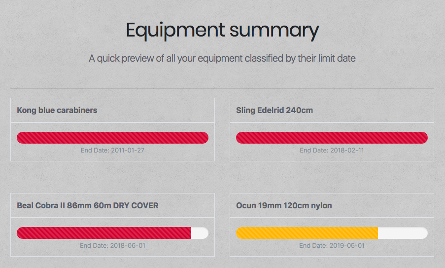
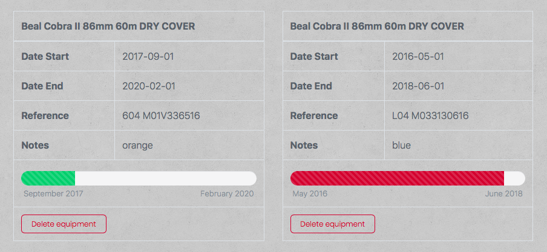

# Until Now ⌛️
En algunas actividades, como en el submarinismo o la escalada, se utilza material técnico especializado y diseñado únicamente para tal fin. Los fabricantes de dicho material establecen una duración máxima de uso para estos productos. Exceder la vida útil de los elementos usados en actividades de riesgo puede tener consecuencias letales.

Until Now te ayuda a gestionar la fecha de renovación del material técnico. La aplicación te permite visualizar rápidamente que material debes descartar y/o renovar próximamente.  

 
Previsualización vista rápida de items.  
  

  
Visualización en detalle de los items.  

## Demo 
Puedes ver una demo del proyecto en **https://until-now.surge.sh**  

* usuario: demo
* password: ABCabc1234

## Until Now (frontend) 
Este repositorio contiene el frontend del proyecto.  

Principales recursos utilizados en frontend:
* [React](https://github.com/facebook/create-react-app) 
* [Bootstrap 4](https://getbootstrap.com) 
* [Shards](https://designrevision.com/downloads/shards/) 
* [Reactstrap](https://reactstrap.github.io) 

## Repositorios relacionados 
Este repositorio es parte del proyecto **Until Now**. Consulta los enlaces proporcionados para obtener más información.   

Enlaces relacionados:
* Repositorio principal y documentación: [Until Now frontend app](https://github.com/didaquis/until-now-frontend) 
* [Until Now client API](https://github.com/didaquis/until-now-client-api) 
* [Until Now server API](https://github.com/didaquis/until-now-server-api) 

Para hacer funcionar la aplicación, debes renombrar el fichero `_env` por `.env` y configurar las variables para la correcta utilización de la API y/o el TDD. Recuerda que también deberás instalar las dependencias. El frontend utiliza la API client para comunicarse con API server. API server se encarga de gestinionar la comunicación con la base de datos.

## Documentación del proyecto 
Estructura de la base de datos:  

  

Arquitectura del proyecto:  

   

------ 

## Futuro del proyecto  
Este proyecto ha sido realizado en 14 días, por lo que se han quedado fuera muchas ideas interesantes. Estas son algunas de ellas: 
* Envío de alertas por email al finalizar la vida útil de los productos 
* Posibilidad de mostrar avisos o envío de alertas cuando el fabricante de un producto lanza una campaña de "recall" de material del cual eres poseedor 
* Al introducir material, la aplicación te sugiere la durabilidad máxima basada en los datos proporcionados por el fabricante 

------

## Sprint Planning
Gestión de tareas: [Kanban](https://trello.com/b/x0Vl2LAY/until-now) 

### Sprint primera semana
#### Lunes
- [x] Definir modelos de datos
- [x] Realizar mockups de las vistas
- [x] Hacer mapa de la relación de collecciones de la base de datos
- [x] Definir la estructura del proyecto
- [x] Web Templating
#### Martes
- [x] Solicitar feedback templating
- [x] Crear las vistas en React
- [x] Crear base de datos
- [x] Crear API server
- [x] API server: listar colecciones e items
#### Miércoles
- [x] Crear API client
- [x] API client: listar colecciones e items
- [x] TDD API client
#### Jueves
- [x] TDD API server
- [x] Listar en frontend colecciones e items
- [x] API server: eliminación de colecciones
- [x] API client: eliminación de colecciones
#### Viernes
- [x] Solicitar feedback
- [x] Testing
- [x] HotFixing
- [x] Deploy sprint
------
### Sprint segunda semana
#### Lunes
- [x] Implementar en frontend la eliminación de items y colecciones
- [x] Implementar funcionalidad cálculo de progreso de vida útil
- [x] Implementar recuento de items en la vista de colecciones
- [x] API server: creación de colecciones
- [x] API client: creación de colecciones
#### Martes
- [x] TDD creación y eliminación de colecciones
- [x] Implementar en frontend la creación de colecciones
- [x] API server: creación items
#### Miércoles
- [x] API client: creación items
- [x] TDD creación y eliminación de items
#### Jueves
- [x] Bug fixings
- [x] Implementar en frontend la creación de items
- [x] Solicitar feedback
#### Viernes
- [x] Testing
- [x] HotFixing
- [x] Revisar la documentación del proyecto
- [x] Deploy sprint
------
### Sprint tercera semana
#### Lunes
- [x] Implementar el datepicker en frontend
#### Martes
- [x] API server: sistema de login
- [x] API client: sistema de login
- [x] TDD sistema de login
#### Miércoles
- [x] Implementar sistema de login y logout en frontend
- [ ] Testing
- [ ] HotFixing
- [ ] Revisar la documentación del proyecto
- [ ] Deploy sprint
#### Jueves
- [ ] Presentación del proyecto 🚀 🎉 

------  
