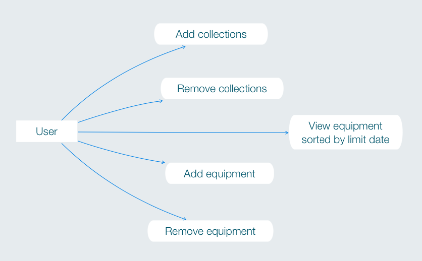

# Until Now ⌛️  
En algunas actividades, como en el submarinismo o la escalada, se utilza material técnico especializado y diseñado únicamente para tal fin. Los fabricantes de dicho material establecen una duración máxima de uso para estos productos. Exceder la vida útil de los elementos usados en actividades de riesgo puede tener consecuencias letales.

Until Now te ayuda a gestionar la fecha de renovación del material técnico. La aplicación te permite visualizar rápidamente que material debes descartar y/o renovar próximamente.  

 
Previsualización vista rápida de items.  
  

  
Visualización en detalle de los items.  

[Slides presentación](https://docs.google.com/presentation/d/1wR7b1NG2EA7UwatwS05HfbMU5Qd-fRm0PDvkmQIIeW0/edit?usp=sharing)  

## Demo 
~~Puedes ver una demo del proyecto en **https://until-now.surge.sh**~~  

* ~~usuario: demo~~
* ~~password: ABCabc1234~~

> **NOTA:** Actualmente la demo se encuentra no disponible.

## Until Now (frontend) 
Este repositorio contiene el frontend del proyecto.  

Principales recursos utilizados en frontend:
* [React](https://github.com/facebook/create-react-app) 
* [Bootstrap 4](https://getbootstrap.com) 
* [Shards](https://designrevision.com/downloads/shards/) 
* [Reactstrap](https://reactstrap.github.io) 

## Repositorios relacionados 
Este repositorio es parte del proyecto **Until Now**. Consulta los enlaces proporcionados para obtener más información.   

Enlaces relacionados:
* Repositorio principal y documentación: [Until Now frontend app](https://github.com/didaquis/until-now-frontend) 
* [Until Now client API](https://github.com/didaquis/until-now-client-api) 
* [Until Now server API](https://github.com/didaquis/until-now-server-api) 

Para hacer funcionar la aplicación, debes renombrar el fichero `_env` por `.env` y configurar las variables para la correcta utilización de la API y/o el TDD. Recuerda que también deberás instalar las dependencias. El frontend utiliza la API client para comunicarse con API server. API server se encarga de gestionar la comunicación con la base de datos.

## Documentación del proyecto 
Casos de uso:  
  

Estructura de la base de datos:  
  

Diagrama de bloques:  
   

------ 

## Futuro del proyecto  
Este proyecto ha sido realizado en 14 días, por lo que se han quedado fuera muchas ideas interesantes. Estas son algunas de ellas: 
* Envío de alertas por email al finalizar la vida útil de los productos 
* Posibilidad de mostrar avisos o envío de alertas cuando el fabricante de un producto lanza una campaña de "recall" de material del cual eres poseedor 
* Al introducir material, la aplicación te sugiere la durabilidad máxima basada en los datos proporcionados por el fabricante 

------

## Sprint Planning
Gestión de tareas: [Kanban](https://trello.com/b/x0Vl2LAY/until-now)  

Roadmap: [sprint planning roadmap](/documentation/SprintPlanning.md)  
