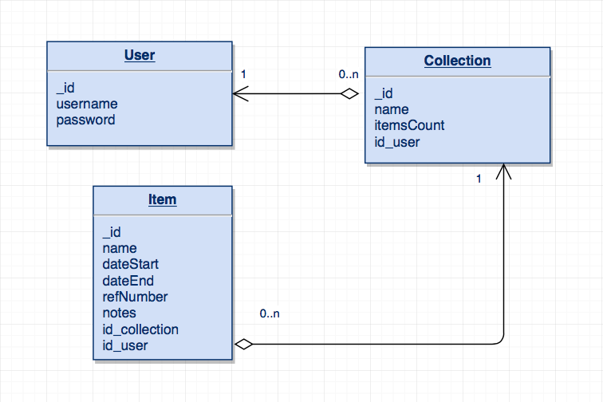
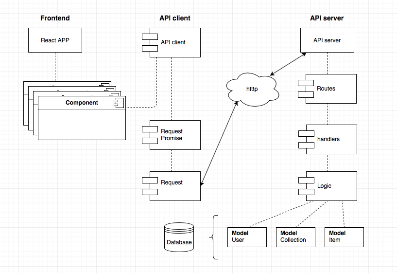

# Until Now

## Until Now (frontend)
En algunas actividades, como en el submarinismo o la escalada, se utilza material técnico especializado y diseñado únicamente para tal fin. Los fabricantes de dicho material establecen una duración máxima de uso para estos productos. Exceder la vida útil de los elementos usados en actividades de riesgo puede tener consecuencias letales.

Until Now te ayuda a gestionar la fecha de renovación del material técnico. La aplicación te permite visualizar rápidamente que material debes descartar y/o renovar próximamente.

## Documentación del proyecto

Estructura de la base de datos:  

  

Arquitectura del proyecto:  

  

Puedes ver los mockups iniciales en:  
[Mockup lista colecciones](documentation/mockup_1.png)
[Mockup lista items](documentation/mockup_2.png)

## Sprint Planning

Gestión de tareas: [Kanban](https://trello.com/b/x0Vl2LAY/until-now)  

------ 

### Sprint primera semana
#### Lunes
- [x] Definir modelos de datos
- [x] Realizar mockups de las vistas
- [x] Hacer mapa de la relación de collecciones de la base de datos
- [x] Definir la estructura del proyecto
- [ ] Web Templating
#### Martes
- [ ] Solicitar feedback templating
- [ ] Crear las vistas en React
- [ ] Crear base de datos
- [ ] Crear API server
- [ ] API server: listar colecciones e items
#### Miércoles
- [ ] Crear API client
- [ ] API client: listar colecciones e items
#### Jueves
- [ ] TDD API server
- [ ] TDD API client
- [ ] Listar en frontend colecciones e items
#### Viernes
- [ ] Solicitar feedback
- [ ] Testing
- [ ] HotFixing
- [ ] Deploy sprint
------
### Sprint segunda semana
#### Lunes
- [ ] API server: sistema de login
- [ ] API client: sistema de login
- [ ] TDD sistema de login
#### Martes
- [ ] Implementar sistema de login y logout en frontend
#### Miércoles
- [ ] API server: creación y eliminación de colecciones
- [ ] API client: creación y eliminación de colecciones
- [ ] TDD creación y eliminación de colecciones
#### Jueves
- [ ] Implementar en frontend la creación y eliminación de colecciones
#### Viernes
- [ ] Solicitar feedback
- [ ] Testing
- [ ] HotFixing
- [ ] Revisar la documentación del proyecto
- [ ] Deploy sprint
------
### Sprint tercera semana
#### Lunes
- [ ] API server: creación y eliminación de items
- [ ] API client: creación y eliminación de items
- [ ] TDD creación y eliminación de items
#### Martes
- [ ] Implementar en frontend la creación y eliminación de items
#### Miércoles
- [ ] Testing
- [ ] HotFixing
- [ ] TDD
#### Jueves
- [ ] Revisar la documentación del proyecto
- [ ] Deploy sprint
- [ ] Preparar la presentación del proyecto
#### Viernes
- [ ] Presentación del proyecto
------